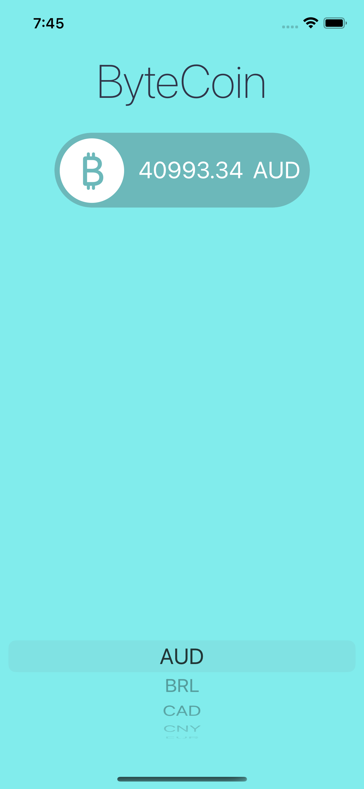
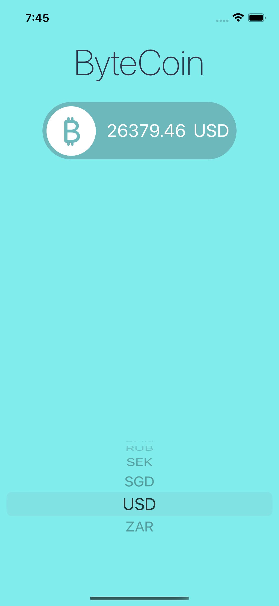

# Bytecoin

## Summary

Bytecoin is an iOS app that fetches real-time Bitcoin prices in the selected currency using the CoinAPI REST API. Users can choose their preferred currency from a picker view, and the app provides up-to-date Bitcoin prices accordingly.

## Technologies Used

- UIKit: The fundamental framework for building iOS user interfaces.
- URLSession: Used to make network requests to fetch Bitcoin prices from the CoinAPI REST API.
- JSONDecoder: Used to parse the JSON data received from the API.
- UIPickerView: Utilized to allow users to select their desired currency for Bitcoin price display.

## Features

- Fetches real-time Bitcoin prices using the CoinAPI REST API.
- Allows users to select their preferred currency from a UIPickerView.
- Utilizes URLSession to handle network requests and retrieve data from the API.
- Provides an intuitive and user-friendly interface to view up-to-date Bitcoin prices.

## Screenshots

<table>
  <tr>
    <td align="center">
       
      Landing Screen
    </td>
    <td align="center">
       
      USD Currency chosen
    </td>
  </tr>
</table>

## Acknowledgments

Thanks to CoinAPI for providing the API to fetch real-time Bitcoin prices and the iOS development community for their support and contributions.

Happy Bitcoin Tracking!
